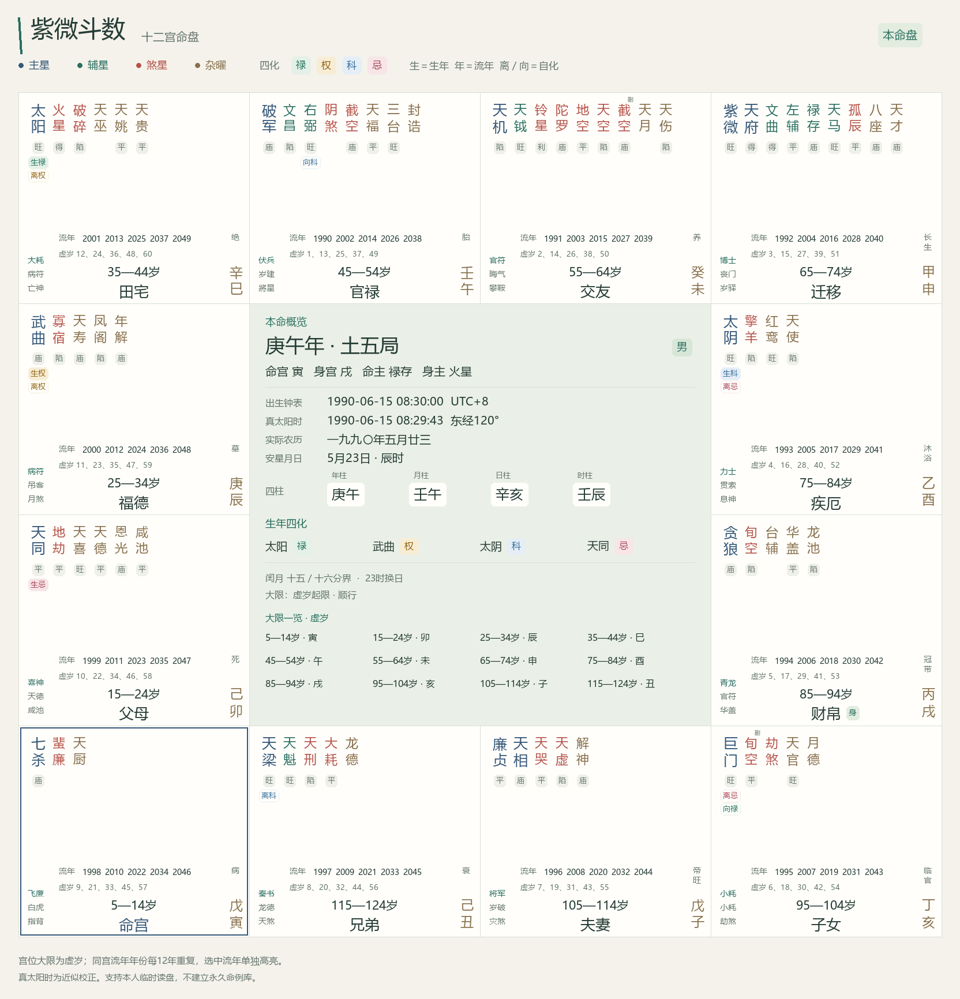
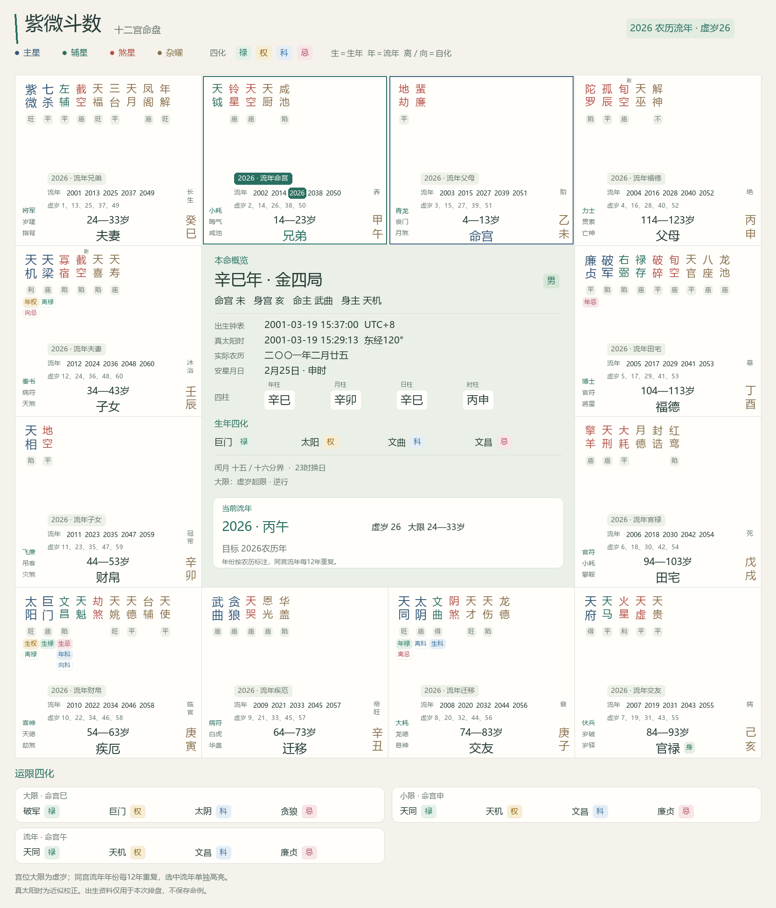

# 紫微斗数排盘

AstrBot 紫微斗数排盘插件，按参考会话提取的文墨天机 2.5.9 安星公式与规则表独立实现。输入出生日期、明确时刻和性别，返回十二宫图片或完整文字盘，支持公历、农历闰月、真太阳时及运限四化。

目录、独立 Git 仓库名与插件标识统一为 `astrbot_plugin_ziwei`，版本 `1.3.1`。排盘计算在本地完成；已开启的群可让 AstrBot 的 LLM 调用排盘与读盘工具。

## 安装

要求 Python 3.10+、AstrBot 4.24.0+。

1. 将整个插件目录放入 AstrBot 的 `data/plugins/`。
2. 在 **AstrBot 实际使用的 Python 环境** 安装依赖：

   ```sh
   python -m pip install -r data/plugins/astrbot_plugin_ziwei/requirements.txt
   ```

3. 在 WebUI 重载插件，检查日志。在目标群由管理员发送 `/紫微 开启`，再发送排盘指令；帮助可通过 `/紫微 帮助` 查看。

Windows 自动查找微软雅黑或黑体，Linux 查找 Noto CJK 或文泉驿，macOS 查找苹方。也可在 WebUI 的 `font_path` 填服务器上中文字体的完整路径。没有可读字体或渲染失败时返回文字盘。

仓库地址：[RioMaker/astrbot_plugin_ziwei](https://github.com/RioMaker/astrbot_plugin_ziwei)。本次版本提供本地安装包，远程安装的版本以仓库已推送内容为准。插件使用平台无关的普通消息和图片组件；真实 AstrBot、QQ／OneBot 及其他平台收发尚待集成验收。

## 指令

`/紫微`、`/紫微排盘`、`/ziwei` 等效；命令前缀随 AstrBot 唤醒前缀配置调整。

所有群默认不在使用白名单内。必须在当前群发送开启指令后，群成员才能排盘；私聊不能排盘或管理群授权，AstrBot 管理员也不能绕过群开启要求。帮助可直接查看。

| 群管理指令 | 权限与效果 |
| --- | --- |
| `/紫微 开启` 或 `/紫微 开` | 群主、群管理员或 AstrBot 管理员将当前群加入白名单 |
| `/紫微 关闭` 或 `/紫微 关` | 同上权限，移除当前群授权，拒绝后续新排盘请求 |
| `/紫微 状态` | 任意群成员查看当前群是否已开启 |

授权按“平台实例 ID＋群 ID”隔离，不随发起成员或会话的用户维度变化。开关由 AstrBot 插件 KV 持久化，重启或重载后保留。升级到 1.1.0 后已有群也须首次开启，没有默认放行或 WebUI 绕过开关。读取失败或授权数据异常时拒绝排盘。

QQ／OneBot 可识别原始事件的群主、管理员角色；角色缺失时使用群成员接口查询，8 秒超时或查询失败时拒绝修改开关。其他平台由 AstrBot 管理员开启或关闭。

```text
/紫微 开启
/紫微 1990-06-15 08:30 男
/ziwei 199006150830 男
/ziwei 19900615083045 男
/ziwei 19900615 0830 男
/紫微 19900615 08:30:30 女 文字
/紫微 农历 2023-闰02-16 12:00 女 真太阳时=关
/紫微 1990-06-15 辰时 男 经度=116.4 时区=8
/紫微 1990-06-15 08:30 男 流年=2026
/紫微 1990-06-15 08:30 男 流盘=2026-10-06 流时=10:00
```

以下示例日期均为虚构演示数据。必须给出日期、时刻和性别。默认公历，可显式写 `公历`／`阳历`；农历须写 `农历`／`阴历`。闰月在月份前写 `闰`。性别接受 `男`／`女`、`male`／`female`。时刻接受 `HH:MM`、`HH:MM:SS` 或十二时辰；时辰名采用本时辰的偶数小时作代表（子时 00:00，巳时 10:00），有精确出生时刻时应填钟表时间。

也可把日期与时刻连写：12 位 `YYYYMMDDHHMM` 或 14 位 `YYYYMMDDHHMMSS`，后面用空格填写性别。分开输入时，时刻额外支持 `HHMM`／`HHMMSS`（如 `0830`、`083045`）。各指令别名、LLM 工具与离线入口都兼容；不接受不完整位数或重复时刻，仍严格检查日期与时间。

支持输入年份 1900—2100，转换和校正后的公历也须在此范围内。不存在的公历日、农历日或闰月会拒绝，不补造未知出生时刻。

| 选项 | 示例与含义 |
| --- | --- |
| 经度 | `经度=116.4`，东经为正、西经为负；默认 120 |
| 时区 | `时区=8`，当时当地 UTC 偏移小时，可含小数；默认 8 |
| 真太阳时 | `真太阳时=开`／`关`，校正经度和均时差；默认开 |
| 闰月 | `闰月=current`／`next`／`split`，本月／下月／十五十六分界；默认 split |
| 子时 | `子时=next_day`／`midnight`，23 时或零点换日；默认 next_day |
| 输出 | `输出=image`／`text`，也可直接在末尾写 图片／文字 |
| 流年 | `流年=2026`，指定农历年份，计算大限、小限、流年宫名和四化 |
| 流盘 | `流盘=2026-10-06`，指定公历日期，增加流月、流日、流时 |
| 流时 | `流时=10:00`，目标钟表时刻；流盘未填流时默认 12:00 |

`流年`、`流盘` 互斥。流盘沿用本次出生资料的经度、时区和校正开关，结果显示校正后的目标时间。虚岁按目标农历年减安星农历生年加一，不查询出生前或十二大限范围外的流盘。

图片采用现代东方配色，并参考用户提供的命盘布局：外围为连贯十二宫格，星曜在各宫顶部竖排，宫名和大限年龄在底部，宫干支和长生在右侧，十二神在左侧；中央集中显示出生资料、四柱与生年四化。本命盘中央附十二大限一览，流盘改为当前流年的年份、干支、虚岁和目标时间。底部单列所选运限的命宫与四化。文字盘仍提供各层宫名与全部四化。

| 星曜颜色 | 显示类别 |
| --- | --- |
| 黛蓝 | 十四主星 |
| 青玉 | 文昌文曲、辅弼、魁钺、禄存与天马 |
| 朱砂 | 羊陀火铃空劫及天刑、天空、空曜、阴煞、劫煞等凶煞标记 |
| 赭金 | 其余杂曜 |

星名颜色表示类别，不随四化变化。庙旺为灰色独立标记；四化为彩色徽标：禄青绿、权金色、科蓝色、忌玫红。`生禄／生权／生科／生忌` 表示生年四化，`年禄／年权／年科／年忌` 表示流年四化；`离`、`向` 徽标分别表示离心、向心自化。副星另标 `副`，身宫标 `身`。

每宫列出对应的农历流年年份与虚岁序列，同宫每十二年重复，最多显示五个年份。本命盘从出生后开始列出，流盘围绕所选年份展示；年份限制在本盘运限及 1900—2100 支持范围内。所选年份在对应宫位单独高亮，并显示 `2026 · 流年命宫` 等当年宫名，方便同时识别本命宫与流年宫。

以下预览采用虚构演示资料 `1990-06-15 08:30 男`，使用插件默认规则；流盘示例选择 2026 农历年。所有示例日期均为演示数据，请替换为实际需要排盘的资料。





## LLM 排盘与读盘

群管理员先在当前群执行 `/紫微 开启`。之后可通过自然语言请求排盘、读出刚才自己的命盘或解释某一宫；无需额外开启插件开关。当前 AstrBot 模型须支持工具调用，并允许使用下列工具。插件使用已有 AstrBot 模型配置，不自行调用模型 API。

| 工具 | 参数 | 功能 |
| --- | --- | --- |
| `ziwei_paipan` | `birth_info`、`send_image`（默认 false） | 使用与指令相同的出生资料格式排盘，返回完整结构化结果；明确需要图片时可同时发送到当前群 |
| `ziwei_get_chart` | `chart_id`、`palace`（均可留空） | 读取当前用户在本群最近一次命盘，或按本命宫名如财帛、夫妻、官禄筛选 |

以下均为虚构演示，可在已开启的群中对 LLM 说：

```text
请按公历1990-06-15 08:30，男，排紫微盘并解释命宫。
请读取我刚才的盘，看看夫妻宫有哪些星和四化。
请按上述资料排2026流年盘，并给我排盘图片。
```

手动 `/紫微` 排出的盘同样可以让模型随后读取。新盘会替换当前用户在当前群的上一张临时盘；提供旧 `chart_id` 时不会误返回新盘。工具只返回计算事实，模型依据这些数据进行解释；出生日期、具体时刻或性别缺失时须询问用户，不得代用帮助示例。

返回值是 JSON，包含 `status`、`chart_id`、`expires_in_seconds`、`data` 与字段说明。`data` 提供规则版本与配置快照、原始及换算出生资料、四柱、命身宫、五行局、十二宫星曜、庙旺、正副星、各层四化和自化、十二神、童限与十二大限、所选流盘。各星仅在所属宫位列出一次。按宫筛选仍保留整体摘要和运限，`palace` 指本命宫名；需要分析流年宫时可取完整盘并读取 `flow_names`。

每次工具调用都检查真实事件的群授权，LLM 无法指定其他群／用户、开启群功能或绕过私聊限制。关闭后拒绝后续读取并清除本群缓存；正在计算的任务在返回前再次复核授权。管理员身份也不能绕过未开启状态。

临时命盘只在插件内存保存，按平台实例、群、发送者隔离，最多 128 份，有效期 15 分钟。读取不会延长有效期；过期条目在后续访问时清理，关闭或重载立即清除。无命盘／过期返回 `not_found`，权限不足返回 `denied`，参数错误返回 `invalid_input`，繁忙返回 `busy`，组件异常返回 `unavailable`。不会从其他成员的缓存取资料。

模型会接收工具返回的命盘 JSON，用于生成回答；正常模型上下文和聊天历史由 AstrBot 管理。插件不把出生资料写入 KV、输入日志或永久命例库，也不会清除已进入聊天历史的数据。

工具通过 [AstrBot 官方 `llm_tool` 装饰器规范](https://docs.astrbot.app/dev/star/guides/ai.html) 注册，参数使用框架要求的 `Args:` 类型说明；接口核对日期 2026-10-07。

## 配置与计算范围

WebUI 的 `_conf_schema.json` 提供字体、输出、历法、四化变体及安星配置。默认使用三合天盘基础公式：闰月十五／十六分界、晚子时换日、全书七级庙旺、第一魁钺表、正副截空旬空、年马、命宫支取命主、阴阳性别顺逆长生、水土共长生。

默认生成 70 个本命星曜实例（主星、辅星、三合杂曜及正副空曜）；长生、博士、岁前、将前独立保存。运限含童限、十二大限、小限和年、月、日、时宫名与本命星四化。此版尚未生成独立的限流曜集合，也未实现原程序三模式门控、天地人盘、定盘、安星码、命例库、四柱反查或八字起运。具体差异见 [实现与规则边界](references/IMPLEMENTATION.md)。

历法使用 `lunar-python 1.4.8`，真太阳时使用独立 Meeus 近似计算。没有打包原程序源码、历法 JavaScript、EXE、字体或 UI 资源，未宣称全盘与原软件逐秒相同。见 [来源记录](references/provenance.json)、[验证记录](VERIFICATION.md)、[第三方说明](THIRD_PARTY_NOTICES.md)。

仅群授权开关通过框架 KV 保存；命盘使用上述临时内存缓存。群聊盘面会显示出生日期，应在需要的群内使用。图片在内存生成，插件代码目录不写运行数据。手动与工具排盘共享最多两个计算并发、四个排盘请求在途，超过时提示稍后重试。

## 离线预览与验证

在插件目录执行，离线预览不依赖 AstrBot：

```sh
python -m pip install -r requirements-dev.txt
python scripts/preview.py "1990-06-15 08:30 男" --output .dev/natal-preview.png
python scripts/preview.py "1990-06-15 08:30 男 流盘=2026-10-06 流时=10:00" --output .dev/flow-preview.png
python scripts/preview.py "1990-06-15 08:30 男" --json --output .dev/chart.json
python scripts/preview.py "1990-06-15 08:30 男 文字" --output .dev/chart.txt
python -m ruff format --check .
python -m ruff check .
python -m pytest -q
```

命令行导出由调用者指定保存位置，插件自身不持久化导出。

## 来源

- 参考会话 `逆向文墨天机程序`，ID `01a1101e-078d-7071-befc-919cf9031da1`，2026-10-06 提取的 2.5.9 文档。
- [AstrBot 消息事件](https://docs.astrbot.app/dev/star/guides/listen-message-event.html)、[插件配置](https://docs.astrbot.app/dev/star/guides/plugin-config.html)、[GreedyStr 源码](https://github.com/AstrBotDevs/AstrBot/blob/master/astrbot/core/star/filter/command.py)，核对日期 2026-10-06。
- [lunar-python](https://github.com/6tail/lunar-python)，MIT 许可。
- 均时差采用 [NOAA 所说明的 Meeus 太阳计算方法](https://gml.noaa.gov/grad/solcalc/calcdetails.html) 的独立近似实现。
